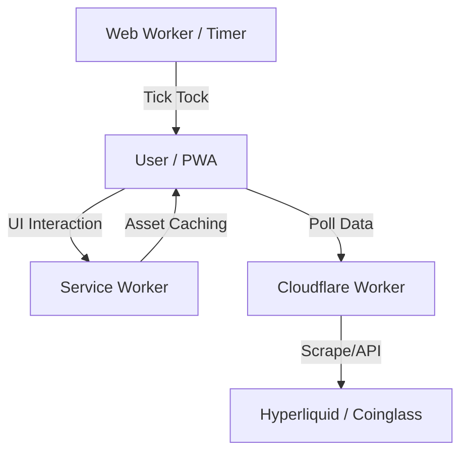

# System Architecture

## 🏗️ High-Level Design

The system follows a **Jamstack** architecture (JavaScript, APIs, Markup), heavily relying on Client-Side Rendering (CSR) and Edge Computing.

## 🧩 Components

### 1. Frontend (The PWA)
- **Location**: `/pwa`
- **Tech**: Vanilla ES6+ JavaScript, HTML5, CSS3.
- **Role**: Renders the UI, manages application state, handles user interaction, and provides offline capabilities.
- **Key Modules**:
  - `app.js`: Entry point and bootstrapper.
  - `ui.js`: DOM manipulation and rendering logic.
  - `chart.js`: Canvas visualization adapter.
  - `api.js`: Data fetching layer.

### 2. Background Processing (The Heartbeat)
- **Location**: `/pwa/timer.worker.js`
- **Role**: Ensures the application keeps "ticking" even when browsers throttle background tabs. It sends a message back to the main thread to trigger `pollLatest()`.

### 3. Edge Layer (The Backend)
- **Host**: Cloudflare Workers
- **Role**: Acts as a proxy and scraper. Since the source data might not have a public CORS-enabled API, the Worker fetches the raw data, parses it, and returns a clean JSON response to our PWA.
- **Endpoints**:
  - `GET /latest`: Returns the current snapshot of positions.
  - `GET /history`: Returns time-series data for the chart.

## 🔄 Data Flow

1.  **Boot**: `app.js` initializes. `initUi()` caches DOM elements. Service Worker registers.
2.  **Tick**: `timer.worker.js` sends a signal every 10s.
3.  **Fetch**: `api.js` requests `${API_BASE}/latest`.
4.  **Delta**: `ui.js` compares `newData` vs `oldData`. If significant change -> Trigger Alert.
5.  **Render**: Data is injected into the DOM. Chart adds the new data point.
