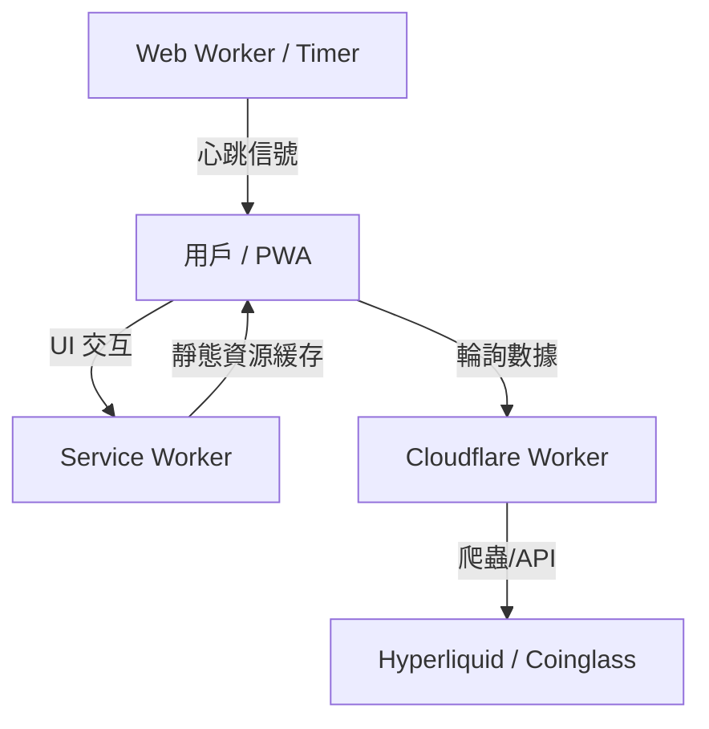

# 系統架構 (System Architecture)

## 🏗️ 高層設計 (High-Level Design)

本系統採用 **Jamstack** 架構 (JavaScript, APIs, Markup)，高度依賴客戶端渲染 (CSR) 與邊緣計算 (Edge Computing)。這種架構不僅成本極低 (幾近免費)，還能提供極高的可用性。

## 🧩 組件詳解 (Components)

### 1. 前端 (The PWA)
- **位置**: `/pwa`
- **技術棧**: Vanilla ES6+ JavaScript, HTML5, CSS3。
- **角色**: 負責 UI 渲染、狀態管理、用戶交互與離線能力。因為不使用 React/Vue 等框架，打包體積極小 (<50KB)，加載速度極快。
- **優點**:
  - **極致效能**: 沒有 Virtual DOM 的開銷。
  - **完全掌控**: 直接操作 DOM，更適合這種高頻更新的儀表板。
- **缺點**:
  - **維護性**: 當專案變大時，手动 DOM 操作會變得難以維護 (但透過良好的模組化設計可緩解)。

### 2. 後台處理 (The Heartbeat)
- **位置**: `/pwa/timer.worker.js`
- **角色**: 這是本專案的關鍵技術突破。它確保應用程式在瀏覽器將分頁「凍結」時，仍能保持運作。
- **為什麼這樣做**: 手機瀏覽器為了省電，會在分頁不可見時停止 `setInterval`。Web Worker 運行在獨立線程，受限較少，能持續發送「心跳」喚醒主線程。

### 3. 邊緣層 (The Backend)
- **託管**: Cloudflare Workers
- **角色**: 作為代理 (Proxy) 與爬蟲。由於源數據可能沒有公開的 CORS API，Worker 負責在伺服器端請求數據、解析 HTML/JSON，並返回乾淨的 JSON 給前端。
- **端點 (Endpoints)**:
  - `GET /latest`: 返回當前持倉快照。
  - `GET /history`: 返回用於繪圖的歷史數據。

## 🔄 數據流 (Data Flow)

1.  **啟動 (Boot)**: `app.js` 初始化。`initUi()` 緩存 DOM 元素。Service Worker 註冊並緩存資源。
2.  **心跳 (Tick)**: `timer.worker.js` 每 10 秒發送一次信號。
3.  **獲取 (Fetch)**: `api.js` 向 Cloudflare Worker發出請求。
4.  **比對 (Delta)**: `ui.js` 比對 `newData` 與 `oldData`。
    - 若 `type === 'all'` 且差異顯著 -> **觸發聲音與視覺警報**。
    - 若其他資產差異顯著 -> **僅觸發視覺警報** (v1.5 新增邏輯)。
5.  **渲染 (Render)**: 數據注入 DOM，圖表推入新點。
